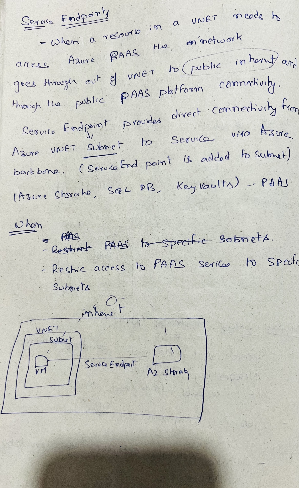
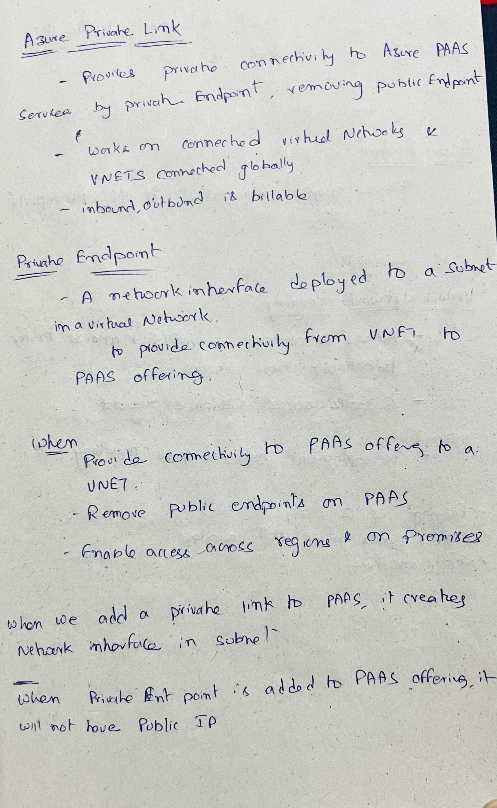

# Service Endpoint, Private Endpoint

<figure><figcaption></figcaption></figure>

<figure><figcaption></figcaption></figure>

Service Endpoint is used to secure traffic to Azue PAAS offering but endpoint is public
